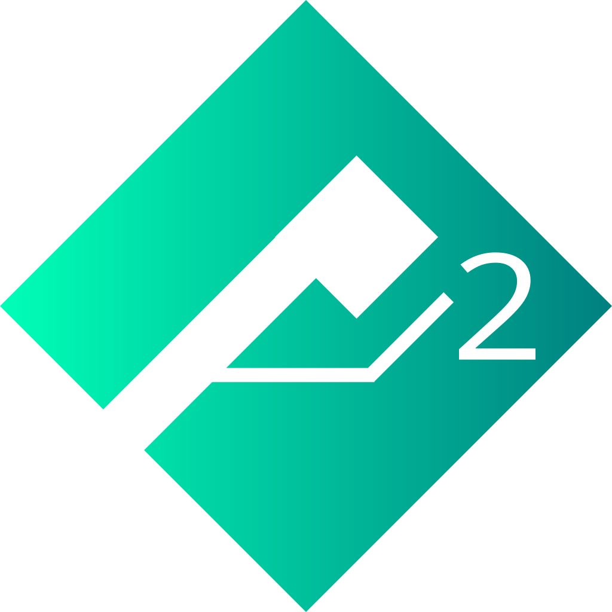

# Mantis2

### Second Generation of the Mantis Game Framework

</img>
 
Mantis is an Apache-liscensed open source game framework based off of LibGDX.

<b>Features include:</b>

1. Functional scene graph
2. Box2D physics backend
3. Box2D lighting integration
4. High-level UI API
5. Organized project structure
6. Ability to load XML scenes
7. Animation support
8. Java 8 lambda support
9. Tiled .tmx format support
10. CSS and XML UI Layouts
